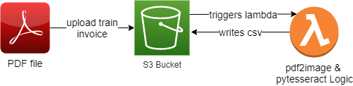
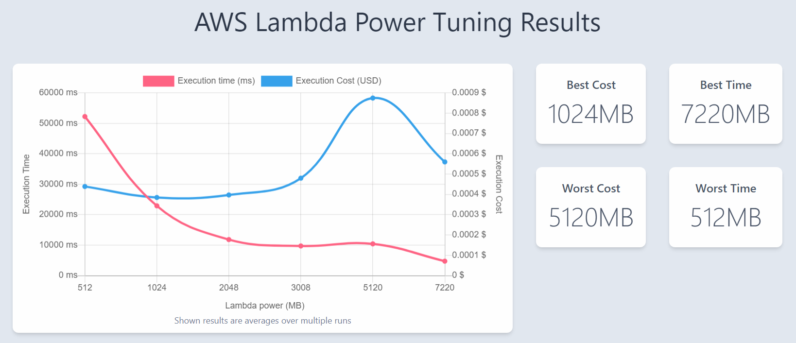

# pytesseract-lambda
This project aims to digitize PDF invoices and parses the most relevant information to an Excel file. This project is custom tailored for the German train (Deutsche Bahn) to parse when I travel from which stations at which cost.

## Description 

The idea of this project is to build an easy to use workflow that parses everything automatically. The workflow looks as follows: 



A PDF file (train invoice) is uploaded to S3. S3 sends an asynchronous event to lambda that is being triggered with the upload event (path to the new file). The lambda function has the [pdf2image library](https://pypi.org/project/pdf2image/) and [pytesseract](https://pypi.org/project/pytesseract/) installed.
Here the magic happens with converting the PDF to an image and then further process it with the OCR engine provided by the open-sourced tesseract project. Here all key information get extracted based on specific keywords (see ```app.py``` line 34, 38, 43, 73). The jupyter Notebook (```.ipynb```) is visualizing the tasks that happen inside this script to understand the algorithm better. <br /> 

This project leverages the trained data in German, however, the English language data set was also downloaded and can be changed by removing the ```lang``` parameter in line 15 of ```app.py```, or by changing the parameter from ```deu``` to ```eng```.

## Setting up the Project 

The project is very easy to set up, since everything runs within a Docker container. Just clone [this repo](https://github.com/lenlehm/pytesseract-lambda)

```
git clone https://github.com/lenlehm/pytesseract-lambda.git
```

Then feel free to make some modification to the logic script of ```app.py``` and save your changes. 
Afterwards you are ready for the building of the docker container. Therefore the ```Dockerfile``` is already in place where we download all the necessary dependencies for the lambda environment. The Dockerfile was built using the [multi-stage built] (https://docs.docker.com/develop/develop-images/multistage-build/), which allows to make the container as small as possible as this will directly determine the performance of our lambda function. Next let's build this container:

```
docker build -t invoicedigitizer .
```

This may take some minutes to complete and you should end up with an image which has roughly 1.12GB. 

After this step is done we are ready to push this container to the Elastic Container Registry (ECR), which basically is AWS solution of Docker Hub. Please create a Repository here called ```invoicedigitizer```. After you have created the repo you should see the instructions to upload it to your previously created repo:

```
aws ecr get-login-password --region <YOUR-REGION> | docker login --username AWS --password-stdin <ACCOUNT-ID>.dkr.ecr.eu-central-1.amazonaws.com
```
```
docker tag invoicedigitizer:latest <ACCOUNT-ID>.dkr.ecr.<REGION>.amazonaws.com/invoicedigitizer:latest
```
```
docker push <ACCOUNT-ID>.dkr.ecr.<REGION>.amazonaws.com/invoicedigitizer:latest
```
Now the heavy lifting is done and you can upload the container to lambda. **Create a new lambda function --> Container image --> Give a proper name & select the perviously uploaded container.**
After that you can test you function locally within the Test menu inside Lambda. I have created a JSON file that is pretty similiar to the event that S3 sends in production: 

```json 
{
  "Records": [
    {
      "eventVersion": "2.0",
      "eventSource": "aws:s3",
      "awsRegion": "<YOUR REGION>", -->YOUR-AWS-REGION-OF-THE-BUCKET
      "eventTime": "1970-01-01T00:00:00.000Z",
      "eventName": "ObjectCreated:Put",
      "userIdentity": {
        "principalId": "EXAMPLE"
      },
      "requestParameters": {
        "sourceIPAddress": "127.0.0.1"
      },
      "responseElements": {
        "x-amz-request-id": "EXAMPLE123456789",
        "x-amz-id-2": "EXAMPLE123/5678abcdefghijklambdaisawesome/mnopqrstuvwxyzABCDEFGH"
      },
      "s3": {
        "s3SchemaVersion": "1.0",
        "configurationId": "testConfigRule",
        "bucket": {
          "name": "<YOUR BUCKET NAME>", -> your-bucket-name-where-you-upload-the-PDFs-to.
          "ownerIdentity": {
            "principalId": "EXAMPLE"
          },
          "arn": "arn:aws:s3:::<BUCKET-NAME>"
        },
        "object": {
          "key": "PDF_TO_JPG/Train_PDFs/file.pdf", -> the-file-location-of-the-pdf-file-with-its-name
          "size": 1024,
          "eTag": "0123456789abcdef0123456789abcdef",
          "sequencer": "0A1B2C3D4E5F678901"
        }
      }
    }
  ]
}
```
After some sucessful tests, you can finally set up the connection from your S3 bucket to Lambda. 
Within the desired bucket go to **Properties** --> **EVENT Notifications** --> **Create Event Notification** --> **Suffix: .jpg** --> **All object create events** --> **Destination: Lambda function & specify the previously created lambda function running your container**.

CONGRATULATIONS that was it. So whenever you upload a PDF file to your bucket this lambda function will be triggered and parse the PDF file based on your code residing in ```app.py```.

### Lambda optimal Parameter Tuning 

In order to make the most of your function, it might be useful to use the [Lambda-Power-Tuner](https://github.com/alexcasalboni/aws-lambda-power-tuning) to optimize for performance or cost. This tool runs your lambda function with different settings of RAM (within Lambda CPU is proportionally allocated to RAM) and outputs the performance and costs, respectively. My results of the Lambda Power Tuner with the RAM setting of ```[512, 1024, 2048, 3008, 5120, 7220]``` look as follows: 



Might be also worth a look for you in order to make the most out of your lambda function.
